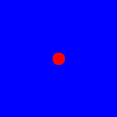
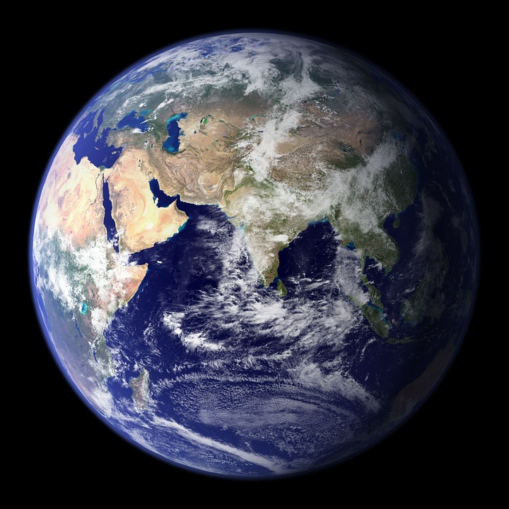
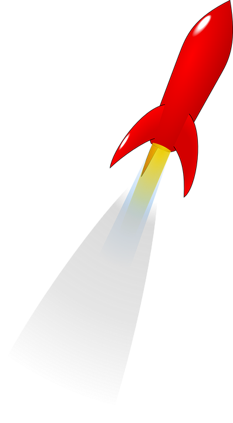
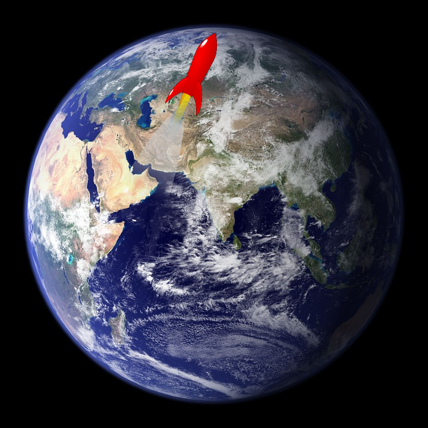
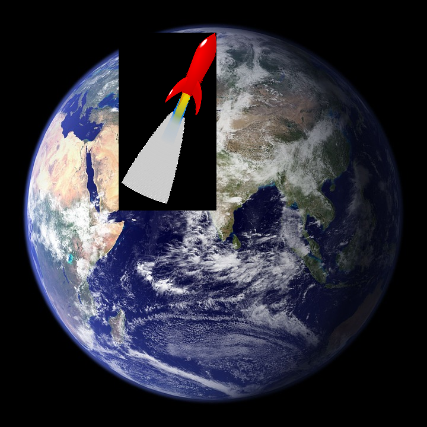
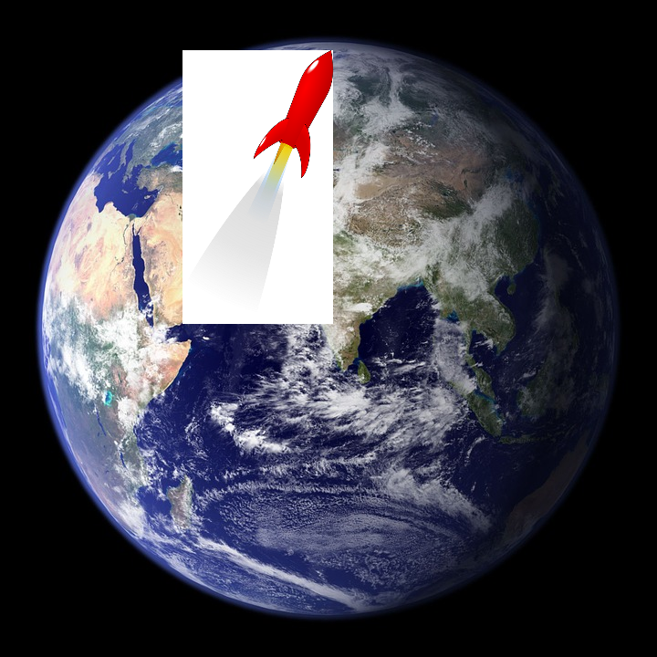

#JIL - Java Image Library

Is a library that allows for easy image manipulation in java. The goal is to wrap all the different java image implementations in a much simpler api.  Currently there are 2 main implementations, the pure java implementation (jil-base) and the awt implementation (jil-awt).  Plans are to add a native/jni implementation as well as an swt and android.

##Examples

###Basic drawing
Here is how to create an image with a blue background and a red circle in it and save it as a png file.
```java
public static void main(String[] args) {
    JilImage ji = JilImage.create(MODE.RGB, 200, 200, Color.BLUE);
    ji.draw().circle(100, 100, 20, Color.RED, 1, true);
    ji.save("/tmp/test.png");
}

```



###Image pasting/merging
Here is an example of opening 2 png files one of the earth and one of a rocket, resizing the rocket and merging it onto the one of the earth.  This uses awt as currently only opening tiff files is supported in jil-base.

Here are the source images:


```java
public static void main(String[] args) {
    AWTImage img1 = AWTImage.open("./examples/earth.png");
    AWTImage img2 = AWTImage.open("./examples/rocket.png");
    img2 = img2.resize(300, 300, true, ScaleType.CUBIC);
    img1.merge(200, 55, img2);
    img1.save("/tmp/example2.png");
}
```


Doing a .merge merges the alpha channels so we dont endup with the rocket over the top of the earth.  If we called .paste it would override all the pixels in the source image with the new image and it would look like this:



It's important to note that the img1 is an RGB image so the alpha channel is discarded on the paste.  If img1 was RGBA (easily coverted with "img1 = img1.changeMode(MODE.RGBA);")it would look like this:



Even though it looks white its actually 100% transparent so its just the backgound of the webpage.

